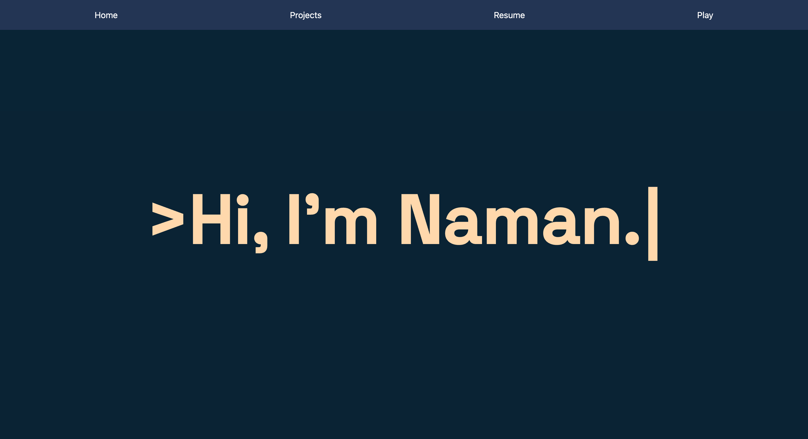
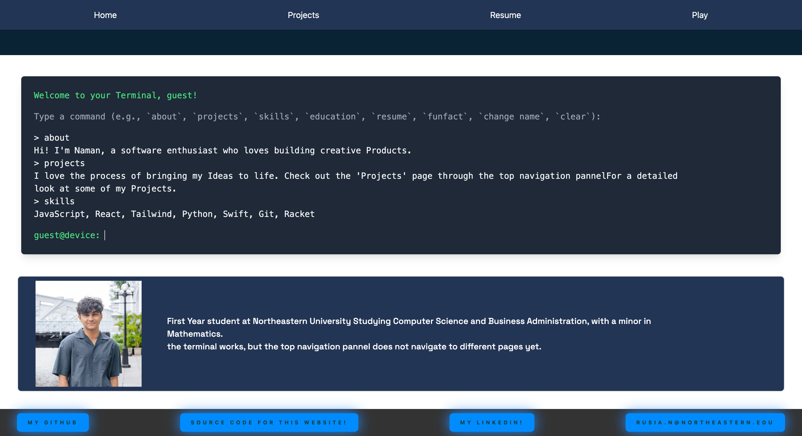
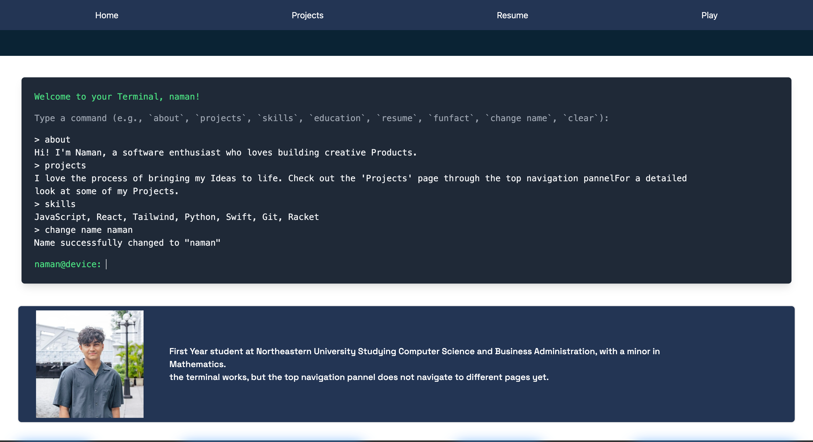
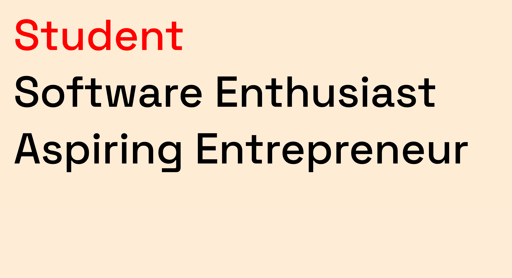

# Welcome to my Personal Website documentation

- I used vite to start this React app project.
- Languages, Technologies and Frameworks used: HTML, CSS, Tailwind, GSAP, React, Animate.css,
- react-router-dom for implementation of routing logic so I can have a robust personal website and not just a single page one.
- hosted and can be viewed on namanrusia.netlify.app ; domain name to be bought soon.

- what is happening

# Current issues and TO-DOs

- Figure out why topnav doesn't show up on the top of /projects /resume and /playpage
- figure out in-page scrolling for the skills sectio
- debug the cursor and see why the cursor image doesnt show up as the cursor on the website
- implement resume downloader logic, and search how I could do that
- add a way to skip the intro navigation for purposes of debugging and backlogging. it is so annoying and lasts quite a bit of time
- COLOR SCHEME. CHANGE IT
- think and brainstorm for creative stuff I can add to the play page. I want the aesthetic of the play page to be completely different to the rest of the website, and I want to venture out of my comfort zone and create some wild animations to showcase some of my front-end learnings
-

# Image Documentation:

As of december 11th, 2024, here is some visual documentation of my website:

Made by Naman Rusia, Last updated December 11th, 2024.

# color references :

Color Hex
Navy #0a192f
Light Navy #112240
Lightest Navy #233554
Slate #8892b0
Light Slate #a8b2d1
Lightest Slate #ccd6f6
White #e6f1ff
Green #64ffda

- fix download and view resume pdf features on netlify.
-
